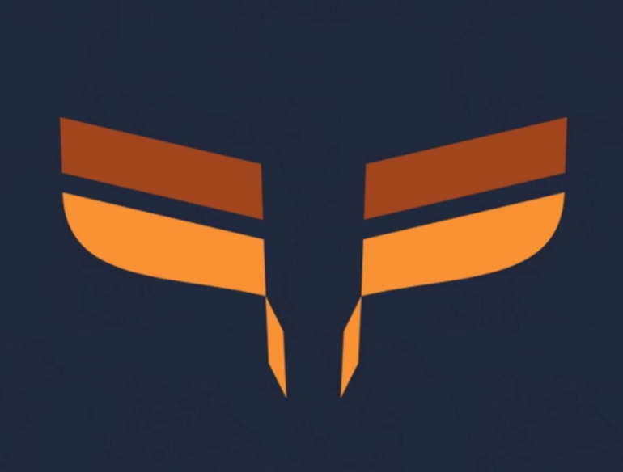

  
  
<b>Aksantara ITB 2024</b>

# Tugas1_RSC_5
> Permainan Drone dengan Konsep Object Oriented Programming (OOP)
## 📑 Table of Contents
  - [Deskripsi Singkat](#🖥️-deskripsi-singkat)
  - [Uji Coba Program](#🦾-Uji-Coba-Program)
  - [Identitas Pembuat Program](#🪪-identitas-pembuat-program)
  - [Fitur Program](#📀-fitur-program)
  - [Struktur Program](#🗂️-struktur-program)
  - [Cara Menggunakan](#🛠️-cara-menggunakan)
    - [Dependensi](#🏋-dependensi)
    - [Instalasi](#🔧-instalasi)
    - [Eksekusi Program](#🏃‍♂️-eksekusi-program)

## 🖥️ Deskripsi Singkat

## 🦾 Uji Coba Program

## 🪪 Identitas Pembuat Program

## 📀 Fitur Program

## 🗂️ Struktur Program

## 🛠️ Cara Menggunakan

### 🏋 Dependensi

### 🔧 Instalasi

### 🏃‍♂️ Eksekusi Program