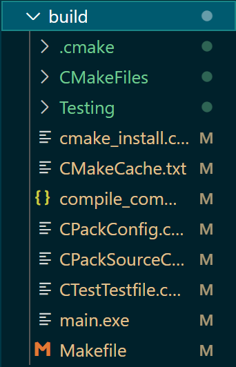
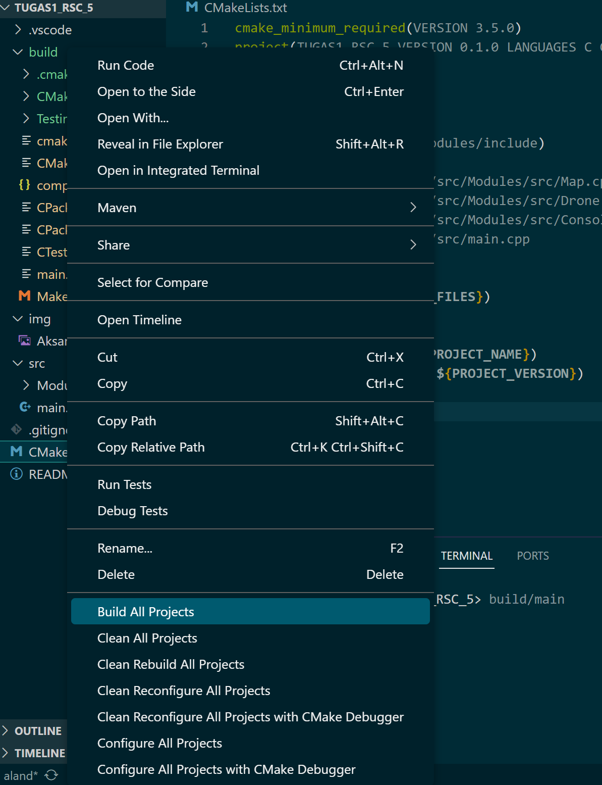

<div align="center">
  
  <p><b>Aksantara ITB 2024</b></p>
</div>

# Tugas1_RSC_5
> Simple Drone Game with Object-Oriented Programming (OOP) Concept
## 📑 Table of Contents
  - [Descriptions](#%EF%B8%8F-descriptions)
  - [Screenshots](#-screenshots)
  - [Contributors](#-contributors)
  - [Features](#-features)
  - [Program Structures](#%EF%B8%8F-program-structures)
  - [How to Use](#%EF%B8%8F-how-to-use)
    - [Dependencies](#-dependencies)
    - [Instalation](#-instalation)
    - [Program Execution](#%EF%B8%8F-program-execution)

## 🖥️ Descriptions
This project aims to introduce Object-Oriented Programming (OOP) concepts through the development of a drone game. The game features a Vertical Take-Off and Landing (VTOL) drone navigating through a map with considerations for battery management and path planning.
## 📸 Screenshots
<div align="center">
  
  <p><i>Menu Drone</i></p>
</div>
<div align="center">
  
  <p><i>Move Drone</i></p>
</div>
<div align="center">
  
  <p><i>Autonomous Mode</i></p>
</div>

## 🪪 Contributors
### Group 5
| Name | NIM |
|---|---|
| Aland Mulia Pratama | 13522124 |
| Radityo Ockta Primadhi | 16923002 |
| Maghryza Milchan Fayumi | 16523111 |
| Karol Yangqian Poetracahya | 19623206 |
## 📀 Features
### Drone VTOL
Drones can take-off and landing (there are take-off conditions and landing conditions). The drone cannot move when it is in landing condition.
### Map
The drone is in a 5x5 two-dimensional world. The drone can move one square at a time.
### Battery
Of course drones have a time limit for hovering in the air. By default, the drone has the capacity to move 10 squares. If the drone battery runs out, the drone is forced into a landing condition and cannot move. The drone can be charged with one command only when landing.
### Path Planning
Autonomous mode on the Drone can only be activated after take off, once activated the program will ask for target coordinates and then the results of the route taken will be displayed.
### Path Planning with Obstacle
Existing target coordinates must be validated, if the coordinates turn out to be an obstacle then they are invalid. Determining the route used is the same as the previous question.
## 🗂️ Program Structures
```bash
.
├── img
│   ├── Aksantara.png
│   ├── Autonomous.png
│   ├── BuildAllProjects.png
│   ├── BuildFolder.png
│   ├── Menu.png
│   └── Move.png
├── src
│   ├── Modules
│   │   ├── include
│   │   └── src
│   └──main.cpp
└── README.md
```
## 🛠️ How to Use
### 🏋 Dependencies
- C++ Programming Language
- CMake Configure
### 🔧 Instalation
1. C++ Programming Language
    - Download the MinGW installer from the official website (http://www.mingw.org/) and follow the installation instructions. Make sure to select the option to install the C++ compiler.
    - Visual Studio: Download Visual Studio from the official website (https://visualstudio.microsoft.com/) and install it. During installation, make sure to select the workload for C++ development.
    - After installing GCC or any other C++ compiler, you can verify the installation by opening a terminal or command prompt and typing `g++ --version`. If GCC is installed correctly, it will display the version information.

2. CMake Configure
    - Visit the official CMake website at https://cmake.org/download/ and download the latest version of CMake for Windows.
    - Once the installer is downloaded, double-click on it to run the installer.
    - The installation wizard will guide you through the installation process. 
    - Add CMake to System PATH
    - After the installation is complete, open a command prompt and type `cmake --version`. 

### 🏃‍♂️ Program Execution
1. Run `CMake Configure` with command pallete in the Main Directory and wait untill the build folder generate.
<div align="center">
  
  <p><i>Build Folder</i></p>
</div>

2. Build All Projects in `CMakeLists.txt`.
<div align="center">
  
  <p><i>Build Projects</i></p>
</div>

3. Input `build/main` in the Project Directory.

4. Terminal Will Display a Simple Drone Game Program with Command Line Interface (CLI)