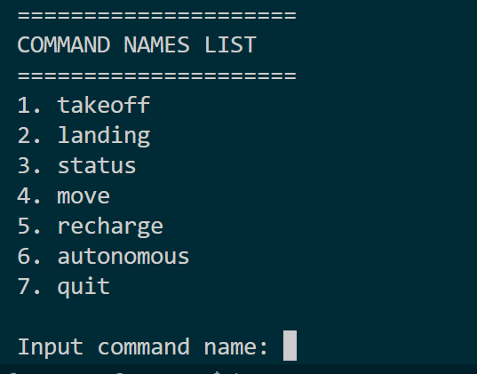
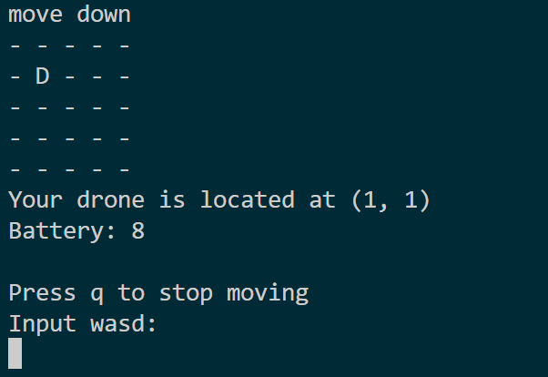

  
  
<b>Aksantara ITB 2024</b>

# Tugas1_RSC_5
> Simple Drone Game with Object-Oriented Programming (OOP) Concept
## 📑 Table of Contents
  - [Descriptions](#%EF%B8%8F-descriptions)
  - [Screenshots](#-screenshots)
  - [Contributors](#-contributors)
  - [Features](#-features)
  - [Program Structures](#%EF%B8%8F-program-structures)
  - [How to Use](#%EF%B8%8F-how-to-use)
    - [Dependencies](#-dependencies)
    - [Instalation](#-instalation)
    - [Program Execution](#%EF%B8%8F-program-execution)

## 🖥️ Descriptions
This project aims to introduce Object-Oriented Programming (OOP) concepts through the development of a drone game. The game features a Vertical Take-Off and Landing (VTOL) drone navigating through a map with considerations for battery management and path planning.
## 📸 Screenshots

  
  
<i>Menu Drone</i>

  
  
<i>Move Drone</i>

  
  
<i>Autonomous Mode</i>

## 🪪 Contributors
### Group 5
| Name | NIM |
|---|---|
| Aland Mulia Pratama | 13522124 |
| Radityo Ockta Primadhi | 16923002 |
| Maghryza Milchan Fayumi | 1652311 |
| Karol Yangqian Poetracahya | 19623206 |
## 📀 Features

## 🗂️ Program Structures

## 🛠️ How to Use

### 🏋 Dependencies

### 🔧 Instalation

### 🏃‍♂️ Program Execution